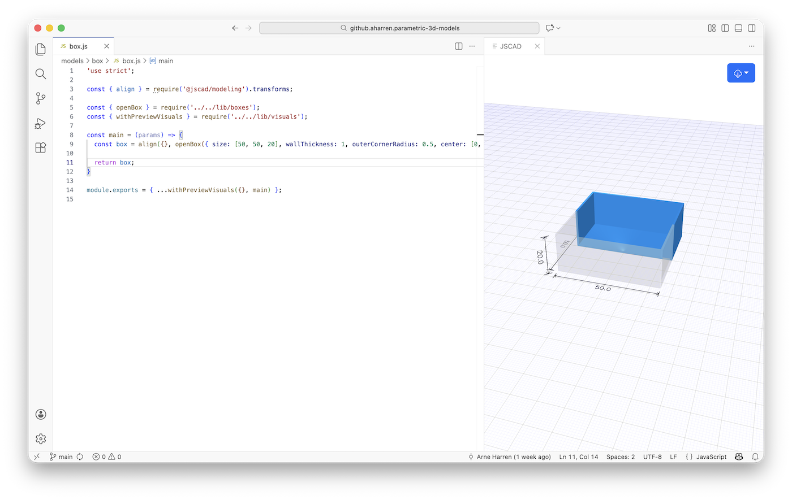

# Parametric 3D Models

Parametric 3D models using JavaScript and [JSCAD](https://github.com/jscad/OpenJSCAD.org).

## Installation

Clone the Git repository and install dependencies via [Node](https://nodejs.org)'s `npm`:

```
git clone https://github.com/aharren/parametric-3d-models.git
cd parametric-3d-models
npm install
```

## Editing

Use [Visual Studio Code](https://code.visualstudio.com) and the [JSCAD Preview extension](https://marketplace.visualstudio.com/items?itemName=codingwell-net.codingwell-vscode-jscad). A preview of a model can be opened via the "Preview JSCAD Model" command, available in the command palette or context menu of the model file. Whenever the mode file is saved, the preview will update.



## STL Creation

Run the `model-to-stla` script and pass the name of the model file to create an STL text file from the model.

Example:
```
./model-to-stla models/box/box.js
```
